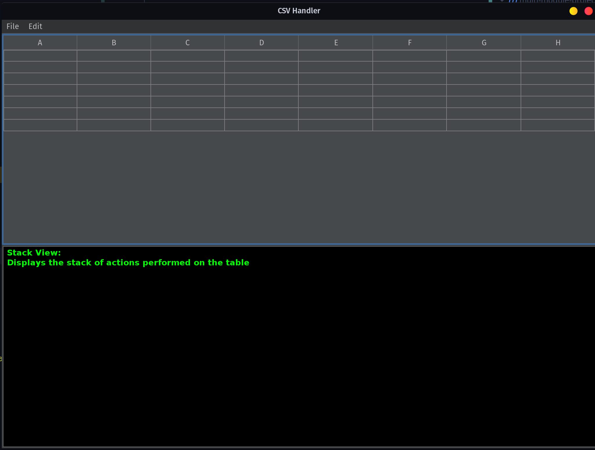
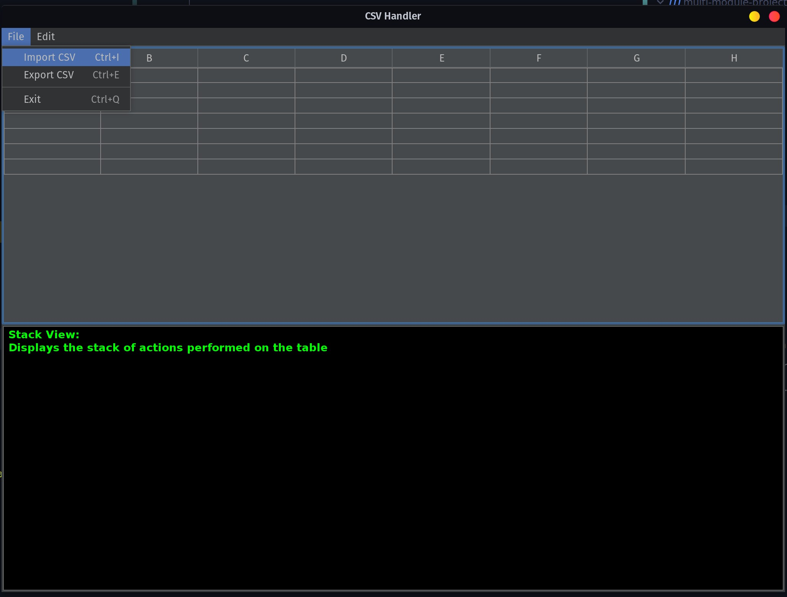
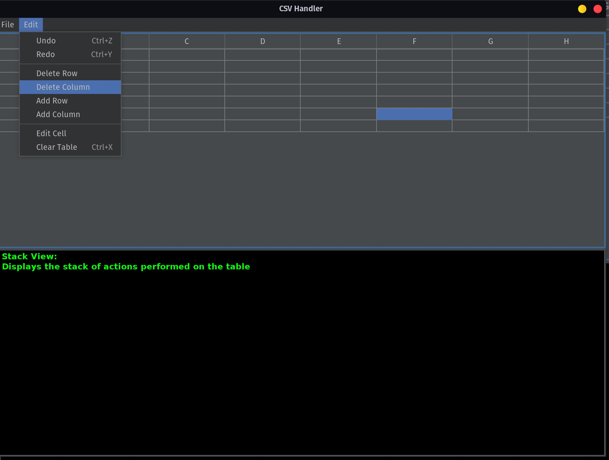
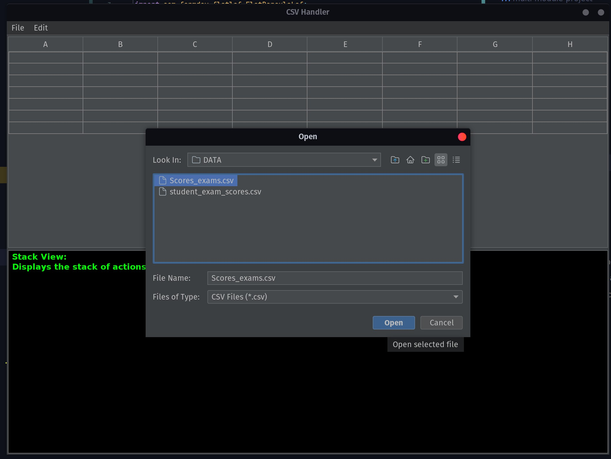
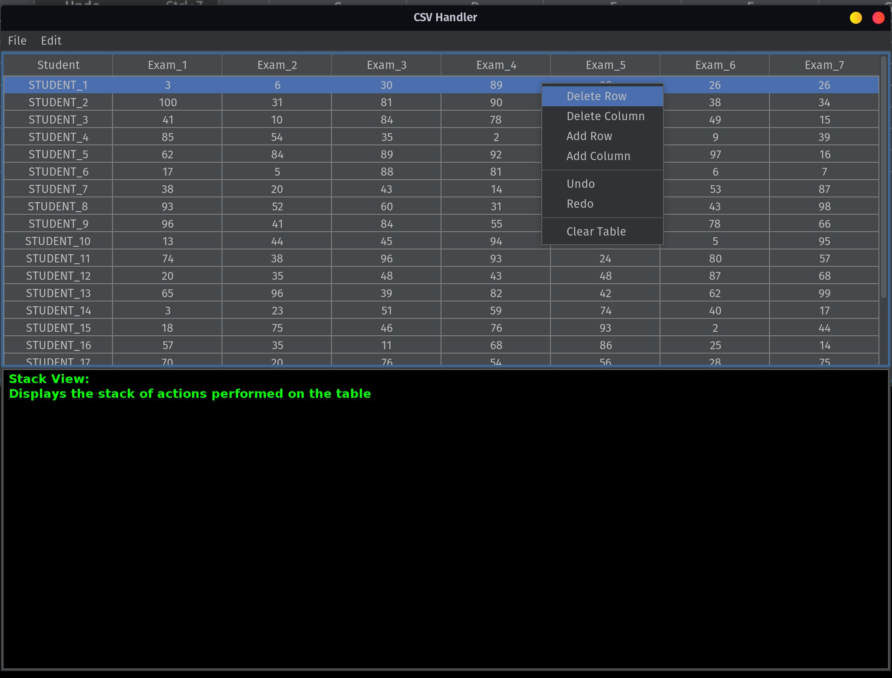
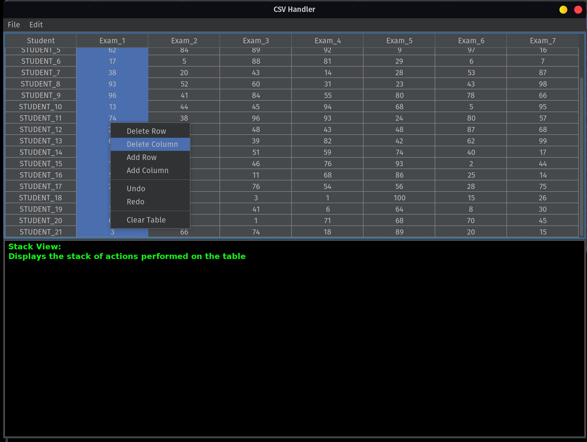
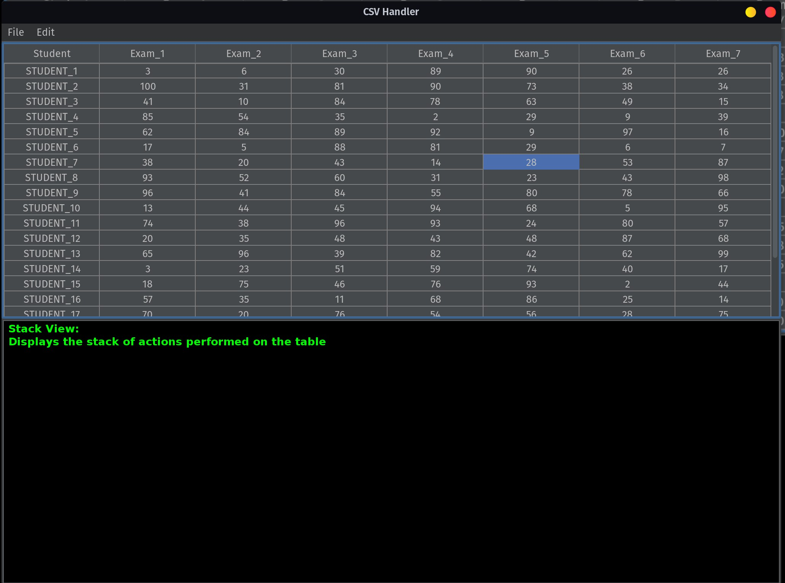

# DRUGA GRUPA ZADATAKA

<div style="text-align:justify">

## ZADATAK 2-1 :

Potrebno je nparaviti GUI prema slici 1 na način da budu zadovoljeni sljedeći uvjeti:

 - Izgled GUI-a (tzv. `Look and Feel`) doradite po vlasitom izboru (primjer imate na slici 1).

>  <b>Look</b> refers to the appearance of GUI widgets (more formally, JComponents) and <b>feel</b> refers to the way the widgets behave. 
>  (Oracle Java Documentation - The Java<sup>TM</sup> Tutorials)


 
 > Upravljanje zavisnostima trebate osigurati primjenom Maven-a kroz pom datoteke

 
 
 > Svaki zadatak treba slijediti pravilo od minimalno četiri commit-a
 
 
 
 **Slika 1** Izgled GUI-a aplikacije za rad s CSV datotekama

Riječ je o jednostavnoj aplikaciji za rad s CSV datotekama. **Važno je da osigurate ispravan način rada aplikacije primjenom načela programiranja pogonjenog događajima (EDP). To podrazumijeva da trebate koristiti tzv. Listenere kako smo pokazali više puta na predavanjima i vježbama. Također, trbate paziti na "zamku" thigh-coupling što nikako neće biti prihvatljivo kao rješenje. Naslikama 2 i 3 prikazani su meniji `File` i `Edit`. 
 
 
 **Slika 2** Prikaz menija `File`
 
 > Dodatno uređivanje GUI-a možete obogatiti korištenjem javnih repozitorija [DJ-Raven](https://github.com/DJ-Raven)



 **Slika 3** Prikaz menija `Edit`

Za čitanje i spremanje CSV datoteka koristite `OpenCSV` što ćete opet realizirati korištenjem Maven-a. Kod uvoza podataka iz CSV datoteke i spremanja u CSV datoteku obavezna je primjena komponente `JFileChooser` koja se direktno otvara u mapi `DATA`, a dozvoljava samo prikaz datoteka s `csv` ekstenzijom. Slika 4 prikazuje učitavanje podataka iz jedne csv datoteke (nalazi se u mapi DATA).



**Slika 4** Prikaz uvoza podataka iz csv datoteke korištenjem JFileChooser komponente

Kada se podaci uvezu - tablica automatski treba biti ažurirana s vrijednostima i strukturom (redovi i stupci po broju, te zaglavlje stupaca). Ukoliko csv datoteka nema stupaca tada možete dodati generički nazive stupaca `Column_n` gdje će n biti redni broj pripadnog stupca. Za tablicu je potom potrebno osigurati mogućnost selektiranja redova (Slika 5), stupaca (Slika 6) i pojedine ćelije (Slika 8) kako biste mogli realizirati naredbe koje se nalaze u meniju `Edit` ili skočnom izborniku (`Pop-up menu`) koji je vidljiv na donjim slikama. 




**Slika 5** Selektiranje i brisanje redka



**Slika 6** Selektiranje i brisanje stupca

 

**Slika 7** Selektiranje ćelije - moguća promjena vrijednosti

Lako zaključujete koji predložak trebate primjeniti &rarr; trebate osigurati `undo` i `redo` gdje se sadržaji stogova prikazuju u za to predviđenom panelu. Isto, tako uvoz i spremanje u csv datoteku treba osigurati primjenom predloška strategija kako biste u bilo kojem trenutku mogli dodati podršku za druge tipove datoteka. 


 ## ZADATAK 2-2  :
  
Ovaj zadatak obrađuje problematiku dinamičkog dodavanja željenog ponašanja objektima neke dobro definirane klase koja se prema potrebi može koristiti u izvornom obliku gdje se to traži.  Kreirajte aplikaciju koja neku tekstualnu datoteku može zapisati u izvornom obliku, potom je može spremiti komprimiranu ili enkriptiranu, a naravno moguća je i kombinacija da je prvo kodiramo pa komprimiramo. Zbog jednostavnosti osigurajte rad samo s tekstualnim datotekama. Dodatni uvjet je da izvor teksta koji predstavlja polazni sadržaj datoteke može biti dobiven iz bilo koje postojeće `.txt` datoteke ili dohvaćanjem cijelog sadržaja neke **web stranice** poznavajući isprava Url te stranice. Očekuje se da je moguće i pročitati zapisani sadržaj. Primjerice mogući tok zapisa i čitanja:
  
  `tekst from URL` &Rarr; `content for txt file` &Rarr; `encryption` &Rarr; `compress` &Rarr; `write in file with defined path`
  
  `read from defined path` &Rarr; `decompress` &Rarr; `decrypt` &Rarr; `show content in console`
  
  
  Polazno sučelje je `DataSource` koje je zadano:
  
  ```java
  interface  DataSource {

    void writeData(String data, File file);
    String readData(File file);
}
  ```
 Drugo sučelje koje vam je zadano je `DataProvider`:
  
  ```java
  public interface DataProvider {

    String provideDataFromSource(String source);
}
  ```
  
Komprimiranje i kodiranje ostvarujete preko apstraktne klase koja omata bilo koji `DataSource`. 
  
  > **SAVJET:**  razmislite što je write kod kriptiranja, a što read; isto tako i kod kodiranja

 Za komprimiranje pogledajte API od `Deflater`, a konačno komprimiranje je vezano uz ptimjenu `Base64.getEncoder()`. Za dekomprimiranje pogledajte API od `Inflater`. Uz kodiranje i dekordiranje pogledajte API klase `Base64`. 
  
  > **VAŽNO:** U svakom slučaju očeuje se da se String zapisuje u datoteku, neovisno radi li se o mogućim omatajućim kombinacijama ili čistoj txt datoteci.
  
Moguća logika testiranja rešnja:
  
  ```
  1. Kreirajte jedan DataProvider -> npr. URL
  2. Dohvaćeni sadržaj kodirajte, pa komprimiranog zapišite u željenu datoteku (uvijek će biti neki txt -> npr. compressEncryptDataFile.txt
  3. Nakon uspješnog zapisa počitajte sadržaj te datoteke i prikažite u konzoli
  ```
  
Rezultat vam je lako kontrolirati jer pročitani sadržaj more odgovarati dohvaćenom sadržaju s poznatg URL-a. Isto tako kontrola kompresije je jednostavna jer datoteka koja je direktno zapisana bez kompresije zauzima više memorijskog prostora od istog komprimirnog sadržaja. Ispravnot kodiranja se još lakše provjeri &rarr; dovoljno je otvoriti txt datoteku s kodiranim sadržajem da se uvjerite kako postupak funkcionira. 
 
 </div>
 
